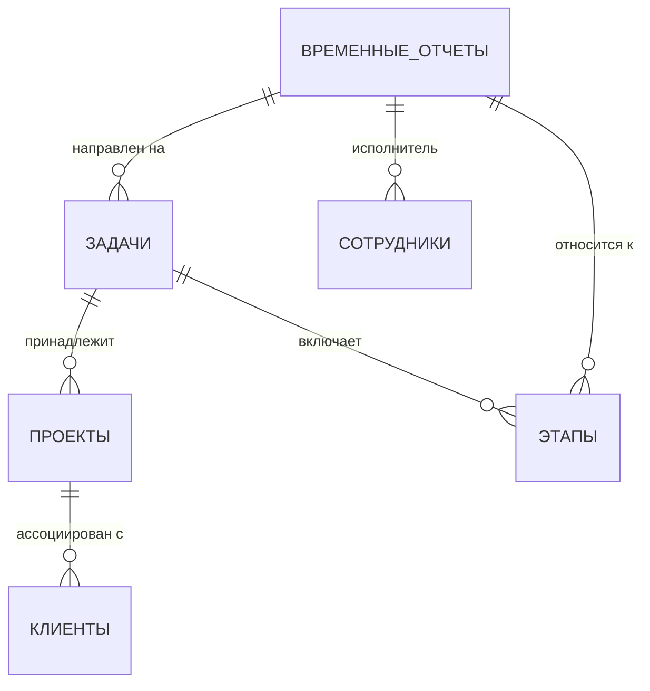

# Архитектура конфигурации 1С: Учет задач разработчиков

## Описание сценария
Конфигурация предназначена для управления цикличными задачами разработчиков 1С: от планирования до расчета стоимости. Основные фокусы: 
- Учет времени работы (с учетом конкретных этапов задач)
- Контроль соответствия плановых/фактических затрат
- Отчетность по клиентам
- Мониторинг прогресса задач в реальном времени

---

## Основные объекты
### 1. **Задачи**
| Реквизит | Тип | Описание | Пример |
|----------|-----|----------|--------|
| Название | Строка | Краткое описание содержания | "Устранить ошибки отчета по затратам" |
| Проект | Ссылка | Связь с проектом | "Бюджетирование 2024" |
| Руководитель | Ссылка | Ответственный менеджер | Иванов И.И. |
| Исполнитель | Ссылка | Разработчик | Петров А.С. |
| Срок_исполнения | Дата | Максимальная дата завершения | 2024-03-15 |
| Статус | Справочник | (Назначен/Планируется/В работе/Завершена) | "В работе" |
| Время_плана | Число | Предполагаемое количество часов | 15 ч |
| Время_факт | Число (**чтение только**) | Рассчитывается из временных отчетов | 12.5 ч |
| Прогресс (%) | Число (**чтение только**) | Рассчитывается по этапам | 75% |

### 2. **Проекты**
| Реквизит | Тип | Описание |
|----------|-----|----------|
| Клиент | Ссылка | Порядок взаимодействия с клиентами |
| Бюджет_план | Число | Стоимость в часах × ставки сотрудников |
| Бюджет_факт | Число (**чтение только**) | Агрегация по всем задачам |
| Статус | Справочник | По умолчанию "В работе" |

### 3. **Временные отчеты**
| Реквизит | Тип | Пример расчета |
|----------|-----|--------------|
| Сотрудник | Ссылка | Уникальный ключ |
| Задача | Ссылка | Уникальный ключ |
| Этап_задачи | Ссылка | Связь с подзадачей |
| Дата_записи | Дата-время | Автозаполнение при подтверждении |
| Время_затраченное | Число | Суммируется через валидацию |
| Примечание | Строка | Дополнительная информация |

### 4. **Этапы задач**
| Реквизит | Тип | Связь |
|----------|-----|--------|
| Задача | Ссылка (односторонняя) | Обеспечивает структуризацию |
| Название | Строка | Например: "Портирование на новую платформу" |
| Важность | Справочник | (Низкая/Средняя/Высокая) |

### 5. **Сотрудники**
| Уникальный реквизит | Тип |
|---------------------|-----|
| ФИО | Строка |
| Ставка_часов | Число | Для расчета бюджета |
| Специализация | Справочник | (Программирование/Тестирование и т.д.) |

### 6. **Клиенты**
| Реквизит | Тип |
|----------|-----|
| Бюджет_проекта | Число | Мониторится отдельно от внутренних затрат |

---

## Связи между объектами


## Валидация данных
1. **Временные отчеты**:
   - Не позволять ввод времени в прошедшую дату, если пользователь не администратор
   - Предупреждать, если сумма превышает "Время_плана" задачи более чем на 20%

2. **Этапы задач**:
   - Не разрешать закрытие задачи, если хотя бы один этап не выполнен

3. **Проекты**:
   - Рассчитывать баланс бюджета при добавлении/обновлении задачи или времени

---

## Отчеты
### 1. **Сводный отчет по проектам**
| Колонка | Формула |
|----------|---------|
| Название_проекта | Ссылка на ПРОЕКТЫ |
| Общий_план | Сумма "Время_плана" по всем задачам |
| Общий_факт | Сумма "Время_факт" по всем временным отчетам |
| Разница | Общий_факт - Общий_план |
| Статус_бюджета | Если Разница > 20% → "Перерасход", иначе "В рамках плана" |

---

### 2. **Отчет по загрузке сотрудников**
| Столбец | Описание |
|---------|----------|
| Максимальная нагрузка | Сумма "Время_план" за месяц / Ставка_часов сотрудника |
| Использованное время | Сумма "Время_факт" |
| Потенциальное риско | (Запланировано - Использовано) / Использовано * 100% |

---

## Методы
### 1. **Расчет бюджета проекта**
```bsl
Функция РассчитатьБюджетПроекта(Проект)
    МестоБюджет = 0;
    Для Каждого Задача Из Проект.Задачи Цикл
        МестоБюджет = МестоБюджет + Задача.Время_плана * Задача.Исполнитель.Ставка_часов;
    КонецЦикла;
    Вернуть МестоБюджет;
КонецФункции
```

### 2. **Индексирование прогресса задачии**
```bsl
// При обновлении статуса этапа → пересчет процентного значения задачи
```

---

## Управление доступом
1. **Роли**:
   - *Разработчик*: Может вносить временные отчеты, изменять собственные задачи
   - *Менеджер*: Может редактировать планирование, изменять статусы
   - *Аналитик*: Только чтение всех отчетов
   - *Клиент*: Доступ к ограниченной части конфигурации (см. разделы)

2. **Примеры ограничений**:
   - Запрет на изменение этапа задачи, если его статус "Завершен"
   - Не отображать проекты, не связанные с клиентом, при просмотре через их интерфейс

---

## Технические особенности
1. **Сетевой график**:
   - Реализация через элемент управления *Диспетчер задач 1С* с возможностью перетаскивания

2. **Интеграция с внешними системами**:
   - Использование REST API 1С для получения данных по ставкам сотрудников из HR-системы
   - Автоматическая выгрузка отчетов в формате Excel (через встроенные функции конфигурации)

3. **Логирование изменений**:
   - Сохранять историю статусов задач и этапов в специальном справочнике "История изменений"

---

## Пример использования
### Сценарий: 
1. Менеджер добавляет задачу в проект "Агрегатор данных"
2. Система автоматически рассчитывает бюджет задачи по ставке Петрова А.С.
3. Петров регистрирует 6 часов на этапе "Настройка интеграции с БД"
4. При пополнении всех этапов до статуса "Завершено" задача обновляется как "Завершена"

---

## Вывод
Такая архитектура обеспечивает полный цикл управления разработкой: от планирования до финальной отчетности. Через использование реквизитов с возможностью автоматического расчета минимизируется риск ошибок. Ограниченный доступ к данным позволяет сохранить конфиденциальность, а отчетность формирует четкое понимание выполнения задач как у разработчиков, так и у заказчика.